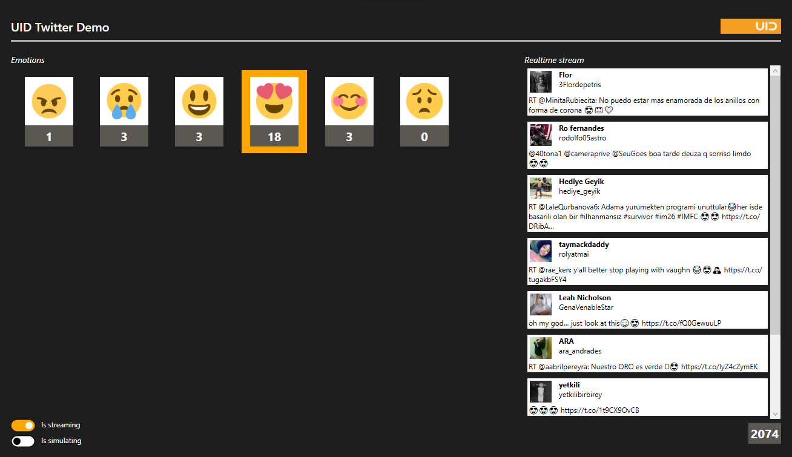

# Reactive samples

This repository contains the two sample applications for the article *Reactive Programming mit .NET*, that is about to be published in a German magazine.

### ReactiveSamples.Interval
This console application demonstrates creating a simple observable using *Observable.Interval* and subscribing to *OneNext* and *OnCompleted*.

### ReactiveSamples.Twitter


This application uses Twitters [streaming APIs](https://dev.twitter.com/streaming/overview) to show the emotions expressed by users in realtime. Tweets are filtered based on usage of emojis.
Please refer to [Run samples](#run-samples) on how to setup the application.

## Tools and Dependencies

### Framework
.NET Framework 4.5.2 and C# 6

### UI
WPF and XAML

### Dependencies
* [Reactive Extensions (Rx.NET)](https://github.com/Reactive-Extensions/Rx.NET)
* [Tweetinvi](https://github.com/linvi/tweetinvi)

### IDE
* Visual Studio 2015 or higher
    * with workload for Windows Desktop Development

## Build

### Build using *build.bat*
1. Open the Developer Command Prompt
2. cd *REPOSITORY*
3. build.bat

### Build using Visual Studio

1. Open ReactiveSamples.sln in Visual Studio
2. Press CTRL + SHIFT + B to build all projects

## Run samples
You have two options to run the app. You can run it standalone without twitter services by using a simulation or you can connect the app to your twitter app account.
For the first option you can compile and run the app and switch a slider on the UI to value "is simulating". After that you may select one emoticon and wait for incoming simulated tweet messages. 
For the latter you need a registered twitter account. Then you can get real twitter data and have a real world twitter service experience.

For using the Twitter API, you have to [register an app](https://apps.twitter.com/) and create a consumer key, consumer token, an access token and access token secret.
Create a file **Keys.cfg** in **src/ReactiveSamples.Twitter/** and add your keys and tokens in the following style:
```
ConsumerKey=YOUR_CONSUMER_KEY
ConsumerSecret=YOUR_CONSUMER_SECRET
AccessToken=YOUR_ACCESS_TOKEN
AccessTokenSecret=YOUR_ACCESS_TOKEN_SECRET
```
A post build script will copy this file to the output directory, so the application can read it out at runtime. Always keep this file for yourself and do not commit it.
**If you prefer not to use real data you can use the simulation mode.** Just flip to switch called *Is simulating* at the bottom of the application.
